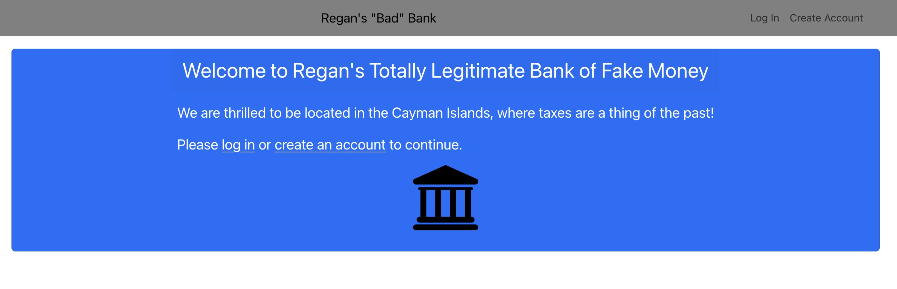
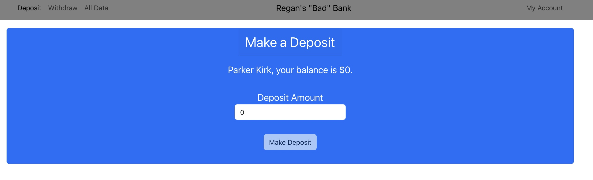

# BadBank
 
<h2>Description</h2>

I built this app as my capstone project for my MIT-Emeritus coding program. Its purpose was to be a full stack application where I was responsible for both the front and back end.

This app simulates the functions of a bank, tracking users and their balances. Users can create accounts, log in and out, deposit and withdraw money, and (if properly credentialed) view all of the bank's data.

<h2>Installation Guidelines</h2>

First, run git clone to create a copy of this repo for yourself. Update the Firebase configuration credentials using your own Firebase account. Use the command node index.js to run this on a local server.

<h2>Screenshots</h2>

<h2>Future Features</h2>

I intend to continue developing the functionality and UI.

<h2>License</h2>

MIT License
