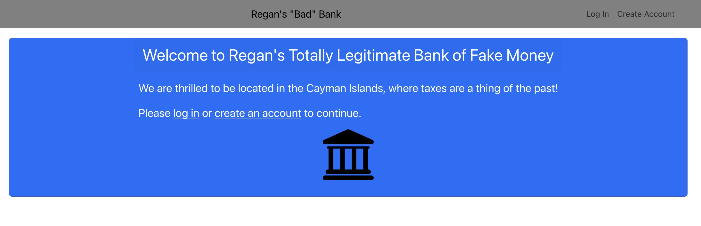
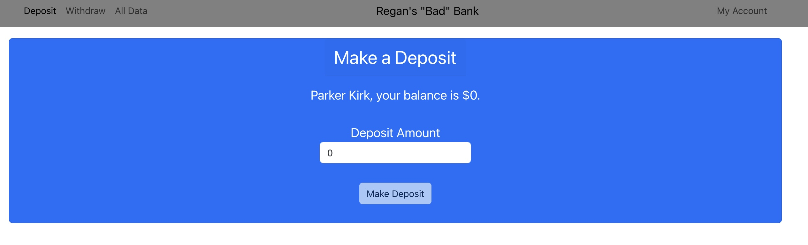

# BadBank
 
<h2>Description</h2>

I built this app as my capstone project for my MIT-Emeritus coding program. Its purpose was to be a full stack application where I was responsible for both the front and back end.

This app simulates the functions of a bank, tracking users and their balances. Users can create accounts, log in and out, deposit and withdraw money, and (if properly credentialed) view all of the bank's data.

<h2>Installation Guidelines</h2>

First, run git clone to create a copy of this repo for yourself. Update the Firebase configuration credentials using your own Firebase account. Use the command node index.js to run this on a local server.

<h2>Screenshots</h2>

<h2>Future Features</h2>

I intend to continue developing the functionality and UI. I plan to add authorization levels. I also want to significantly improve how this looks, including adding a fake logo.

<h2>License</h2>

MIT License

Copyright (c) 2020 John Williams

Permission is hereby granted, free of charge, to any person obtaining a copy
of this software and associated documentation files (the "Software"), to deal
in the Software without restriction, including without limitation the rights
to use, copy, modify, merge, publish, distribute, sublicense, and/or sell
copies of the Software, and to permit persons to whom the Software is
furnished to do so, subject to the following conditions:

The above copyright notice and this permission notice shall be included in all
copies or substantial portions of the Software.

THE SOFTWARE IS PROVIDED "AS IS", WITHOUT WARRANTY OF ANY KIND, EXPRESS OR
IMPLIED, INCLUDING BUT NOT LIMITED TO THE WARRANTIES OF MERCHANTABILITY,
FITNESS FOR A PARTICULAR PURPOSE AND NONINFRINGEMENT. IN NO EVENT SHALL THE
AUTHORS OR COPYRIGHT HOLDERS BE LIABLE FOR ANY CLAIM, DAMAGES OR OTHER
LIABILITY, WHETHER IN AN ACTION OF CONTRACT, TORT OR OTHERWISE, ARISING FROM,
OUT OF OR IN CONNECTION WITH THE SOFTWARE OR THE USE OR OTHER DEALINGS IN THE
SOFTWARE.
